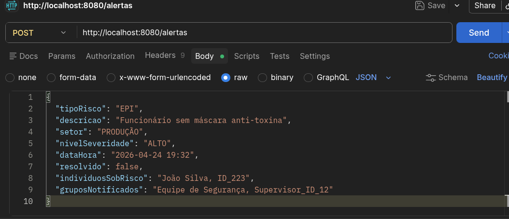
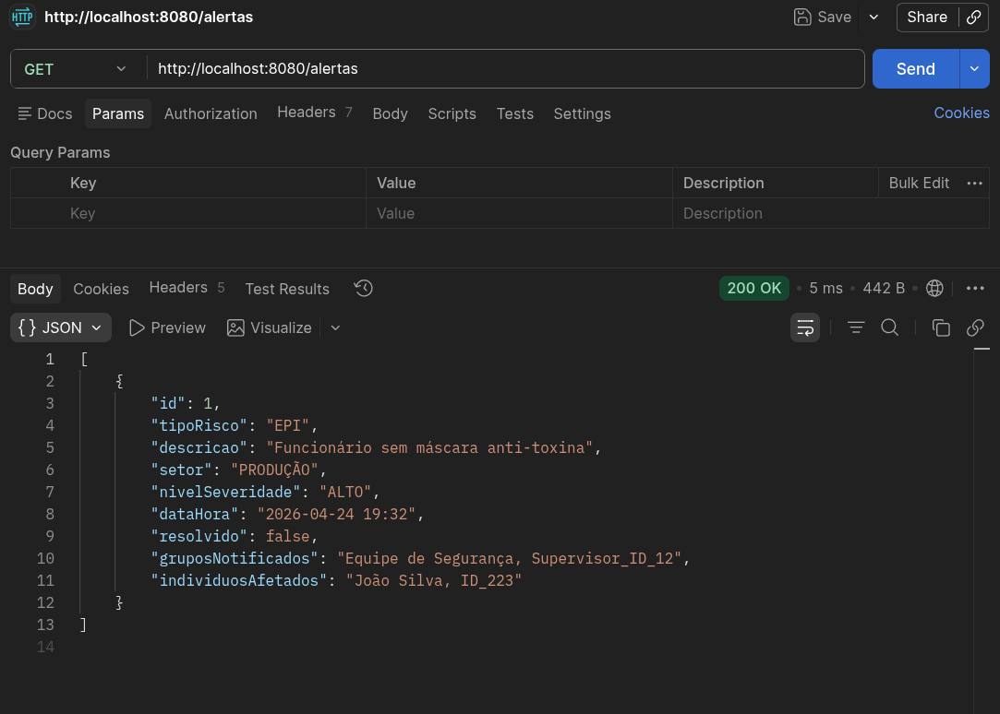
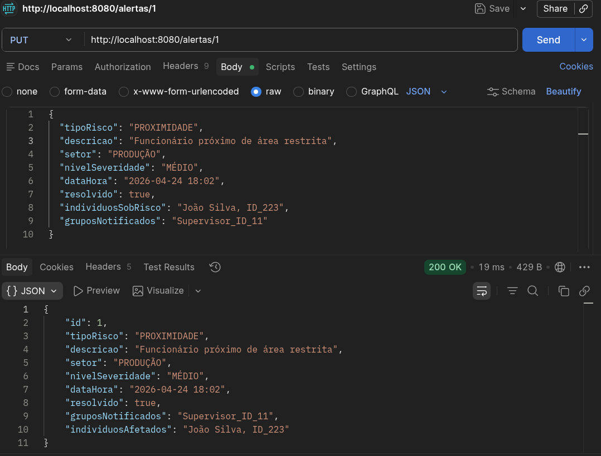
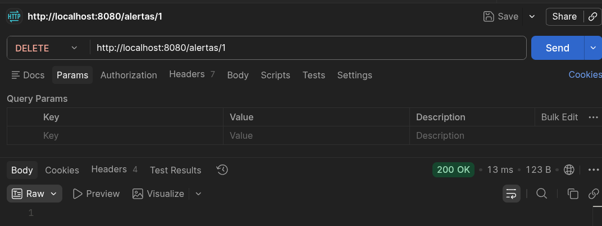

# Challenge Sprint 1 🏫

## 🖥️ Descrição da API e tecnologias
A API desenvolvida nessa sprint representa o gerenciamento de alertas industriais em um cenário de segurança baseado em visão computacional. A aplicação permite o cadastro, consulta, atualização e remoção de registros de alerta relacionados a situações de risco em ambiente industrial. Por se tratar de uma aplicação básica, apenas a função de alerta está presente, porém em um projeto real teria outras entidades como "Equipamento" e "SensorMovimento" por exemplo.

A proposta foi desenvolvida com Spring Boot, Java 17, Spring Web, Spring Data JPA, Maven e banco H2 em modo file, seguindo a arquitetura utilizada nas aula.

## 🗂️ Estrutura do Projeto
```
src/main/java/com/advancedprogramming/mobiledev/
├── controller
│   └── AlertaIndustrialController.java
├── model
│   └── AlertaIndustrial.java
├── repository
│   └── AlertaIndustrialRepository.java
├── service
│   └── AlertaIndustrialService.java
└── Sprint1Application.java
```
## ⚙️ Como utilizar 

Para executar a API, é necessário abrir o projeto em uma IDE compatível com Java e Spring Boot (no meu caso utilizei o Visual Studio Code).
A aplicação pode ser iniciada executando a classe principal `Sprint1Application.java`.
Após a execuão, a API estará disponível localmente e poderá ser testada utilizando ferramentas como Postman, por meio dos endpoints REST.
O banco de dados H2 pode ser acessado via navegador pelo endereço:
http://localhost:8080/h2-console

A configuração de conexão se encontra no arquivo `application.properties`.

JSON de exemplo:
  ```
  {
    "tipoRisco": "EPI",
    "descricao": "Funcionário sem máscara anti-toxina",
    "setor": "PRODUÇÃO",
    "nivelSeveridade": "ALTO",
    "dataHora": "2026-04-24 19:32",
    "resolvido": false,
    "individuosSobRisco": "João Silva, ID_223",
    "gruposNotificados": "Equipe de Segurança, Supervisor_ID_12"
  }
  ```
Endereço dos dados: http://localhost:8080/alertas

Primeiramente se faz a criação destes dados JSON pelo Postman com o comando POST de acordo com a imagem seguinte:



Após a execução, pode-se confirmar a presença dos dados usando o comando GET:



Depois, estes mesmos dados podem ser alterados com o comando PUT usando o mesmo URL, porém com o ID recebido no final após a utilização do comando POST no final do URL:



Por fim, pode ser feita a deletação dos dados utilizando o mesmo ID com o comando DELETE, assim esvaziando a lista por não possuir outros dados nela:



Os dados se mantém presentes mesmo após a reinicialização da aplicação, servindo assim como um modelo básico de sistema, capaz de demonstrar como funcionaria o armazenamento de dados referentes a alertas, sendo apenas uma fração do que poderia ser um sistema de detecção de risco em tempo real.